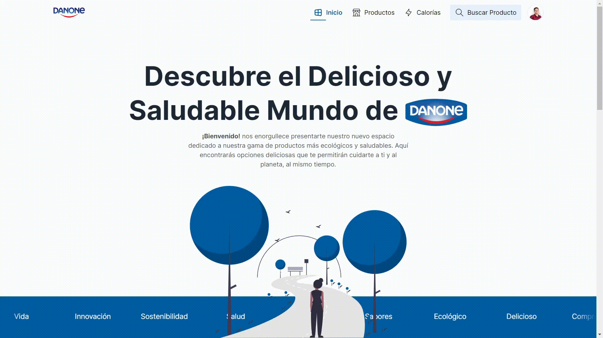

# Organic Healthier Danone Web 

Web page to promote the range of organic and healthier products of Danone.
  <div style="display:grid; place-items:center">
    </img>
  </div>

<br>

## Demo
Check the app [here](https://danone-healthy.web.app/)

## Stack
 - Angular v16
 - Node v16+
 - Contentful v1
 - Firebase Hosting
## Requirements
 - Node v16+

## Installing
Once downloaded or clonned the project, move to the project folder and install the dependencis with the next command:
 ```powershell
 npm install
 ```
## Development server

Run `ng serve` for a dev server. Navigate to `http://localhost:4200/`. The application will automatically reload if you change any of the source files.

## Decision making

This project was made in Angular because is a great and powerful framework to develop Websites and I have been working with it for more than 3 years. The Contenful Headless CMS was chosen because was suggested during the event. 

Based on the requirements of the challenge, I set the next routes:

- <strong>'/'</strong>  Landing Page (Home)
- <strong>'/productos'</strong>  Products Page (List all products)
- <strong>'/productos/:productId'</strong>  Product Detail Page (Show the detail of a Product)
- <strong>'/calorias'</strong>  Calories Page (Allow configurate the maximum daily calorie limit)
- <strong>'/cuenta'</strong> User account Page (Allow the user to see and edit its own data)
